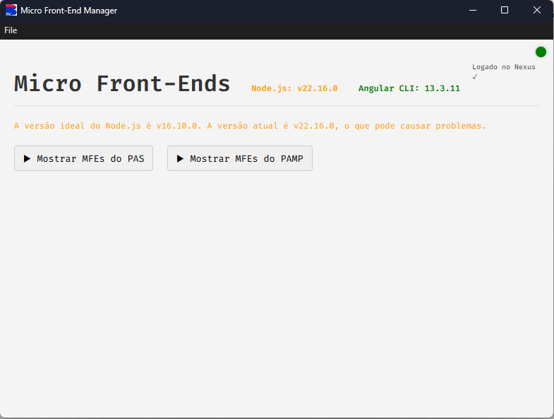

# Micro Front-End Manager

**Micro Front-End Manager** é um aplicativo desenvolvido em Electron para gerenciar projetos de micro front-ends. Ele permite clonar, iniciar, parar e excluir projetos de forma simples e eficiente, além de verificar dependências como Node.js e Angular CLI.

---

## 📋 Funcionalidades

- **Gerenciamento de Projetos**:
  - Clonar projetos de repositórios.
  - Iniciar e parar servidores locais.
  - Excluir projetos e limpar diretórios.

- **Verificação de Dependências**:
  - Verifica se o Node.js e o Angular CLI estão instalados.
  - Exibe alertas caso as versões não sejam compatíveis.

- **Interface Simples**:
  - Inputs para definir caminhos de projetos.
  - Botões para ações como "Baixar", "Iniciar", "Parar" e "Deletar".

---

## 🛠️ Dependências

### Dependências de Produção
- **[Electron](https://www.electronjs.org/)**: Framework para criar aplicativos desktop com tecnologias web.
- **[Node.js](https://nodejs.org/)**: Ambiente de execução JavaScript necessário para o funcionamento do app.

### Dependências de Desenvolvimento
- **[@electron-forge/cli](https://www.electronforge.io/)**: Ferramenta para empacotar e criar instaladores para o aplicativo.
- **[@electron-forge/maker-squirrel](https://www.electronforge.io/makers/squirrel)**: Maker para criar instaladores no Windows.
- **[@electron-forge/maker-zip](https://www.electronforge.io/makers/zip)**: Maker para criar pacotes ZIP.
- **[@electron-forge/maker-deb](https://www.electronforge.io/makers/deb)**: Maker para criar pacotes `.deb` no Linux.
- **[@electron-forge/maker-rpm](https://www.electronforge.io/makers/rpm)**: Maker para criar pacotes `.rpm` no Linux.

---

## 🚀 Como Instalar e Executar

### Pré-requisitos
- **Node.js**: Certifique-se de que o Node.js está instalado. A versão recomendada é `v16.10.0`.
- **NPM**: O gerenciador de pacotes do Node.js.

### Passos para Instalar
1. Clone o repositório:
   ```bash
   git clone https://github.com/seu-usuario/micro-front-end-manager.git
   cd micro-front-end-manager
   ```

2. Instale as dependências:
  ```bash
  npm install
  ```

3. Inicie o aplicativo:
  ```bash
  npm start
  ```
### 🖥️ Como Usar
#### Login no NPM:

Antes de iniciar ou baixar projetos, faça login no NPM:

Insira suas credenciais do NPM.
Baixar um Projeto:

Insira o caminho do projeto no campo de input.
Clique no botão "Baixar Projeto".
Iniciar um Projeto:

Após baixar o projeto, clique no botão "Iniciar" para rodar o servidor local.
Parar um Projeto:

Clique no botão "Parar" para interromper o servidor local.
Excluir um Projeto:

Clique no botão "Deletar" para remover o projeto do diretório.

### 🛠️ Empacotar e Distribuir
Para criar um instalador do aplicativo, execute:
```bash
npm run make
```

O instalador será gerado na pasta make. Envie o arquivo Setup.exe para os usuários.

### ⚠️ Notas Importantes
Certifique-se de que o Node.js e o Angular CLI estão instalados antes de usar o aplicativo.
O aplicativo verifica automaticamente as versões recomendadas:
Node.js: v16.10.0
Angular CLI: 13.3.11

### Licença
Este projeto está licenciado sob a licença ISC.

### ✨ Autor
Desenvolvido por Juliano Soder.

------
### Correção de bugs e fixes

---

## 📝 Funcionamento do Login e Gerenciamento de Projetos

### Como funciona o login no NPM

- Para realizar o login, é necessário que exista pelo menos um projeto MFE (O ROOT NÃO CONTA) salvo e com o caminho configurado corretamente.
- O aplicativo procura um arquivo `.npmrc` dentro do caminho do projeto para validar se o login pode ser realizado.
- Se não houver nenhum projeto válido, um alerta será exibido informando que é necessário cadastrar um projeto antes de fazer login.

### O que acontece ao definir ou limpar o caminho do projeto

- **Definir caminho válido:**  
  O aplicativo verifica se o caminho existe e se contém um arquivo `.npmrc`. Se sim, o projeto é considerado válido para login e outras operações.
- **Limpar o campo do caminho:**  
  O campo pode ser limpo sem causar erro. O projeto ficará inativo para operações que dependem de um caminho válido.
- **Inserir caminho inválido:**  
  O aplicativo não executa operações e exibe mensagens de erro amigáveis, sem travar ou lançar exceções.

### O que cada botão faz

- **Login:**  
  Abre uma janela para realizar o login no NPM usando o projeto selecionado. Só funciona se houver um projeto válido com `.npmrc`.
- **Baixar Projeto:**  
  Clona o repositório informado no campo de caminho e adiciona à lista de projetos.
- **Iniciar:**  
  Executa o servidor local do projeto selecionado, se o caminho for válido.
- **Parar:**  
  Interrompe o servidor local do projeto selecionado.
- **Deletar:**  
  Remove o projeto da lista e apaga os arquivos do diretório informado no caminho.

### Observações importantes

- O arquivo de projetos (`projects.txt`) é salvo em uma pasta de dados do usuário, garantindo que cada usuário tenha seu próprio ambiente e evitando erros de permissão.
- O aplicativo faz todas as validações necessárias antes de executar operações críticas, exibindo mensagens claras para o usuário em caso de erro ou configuração incorreta.
- Todas as operações são feitas de forma segura, evitando tentativas de acesso a caminhos vazios ou inválidos.

---

### Nova versão do MFEM v0.0.2




### Atualizações da versão MFEM v0.0.2
##### 🚀 Changelog

Novos recursos:

  Suporte aos projetos PAMP:
    
    Agora é possível gerenciar e executar projetos MP-PAMP, além dos já suportados projetos MP-PAS
    Interface adaptada para distinguir entre projetos PAS e PAMP
    Detecção automática do tipo de projeto com base no nome do diretório
    Melhorias de comandos

  Comandos específicos por tipo de projeto:
    
    Projetos PAMP agora usam ng serve para inicialização
    Projetos PAS continuam usando os comandos específicos para single-spa
    O comando para MP-PAS-ROOT permanece como npm run start

  Melhorias de interface:
    
    Logs específicos para projetos PAMP:
    Mensagens de log separadas para projetos PAMP
    Indicação visual do tipo de projeto sendo executado

  Melhorias de detecção:
    
    Detecção automática de portas:
    Quando um projeto PAMP encontra uma porta em uso, a porta é automaticamente detectada e salva
    Tentativa automática de liberação da porta e reinício do projeto

  Melhorias na usabilidade:
    
    Controle de logs duplicados
    Filtragem inteligente de mensagens duplicadas, especialmente para "Compiled successfully"
    Intervalo mínimo para exibição de mensagens repetidas, mantendo o log limpo

  Melhor gerenciamento de erros:
    
    Detecção específica de problemas de versão:
    Verificação de compatibilidade com Node.js v16.10.0 para projetos PAMP
    Orientações detalhadas para correção quando detectadas versões incompatíveis
    Refinamento da experiência do usuário

  Status de projeto mais precisos:
    
    Feedback visual aprimorado sobre o estado atual de cada projeto (rodando, parado, parando)
    Botões adaptados para refletir ações disponíveis de acordo com o estado do projeto
